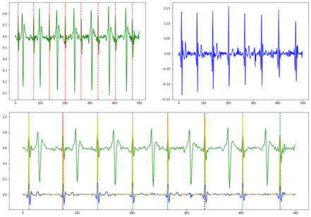

# Fetal ECG Extraction

Repo for extracting fetal signals and peaks from Abdominal ECG. Example: 

Green is original filtered AECG signal, blue is extracted fetal signal, yellow is predicted probability of peak,  
light blue vlines are peaks from yellow with threshold (>0.5), and red are the ground truth fetal peaks.